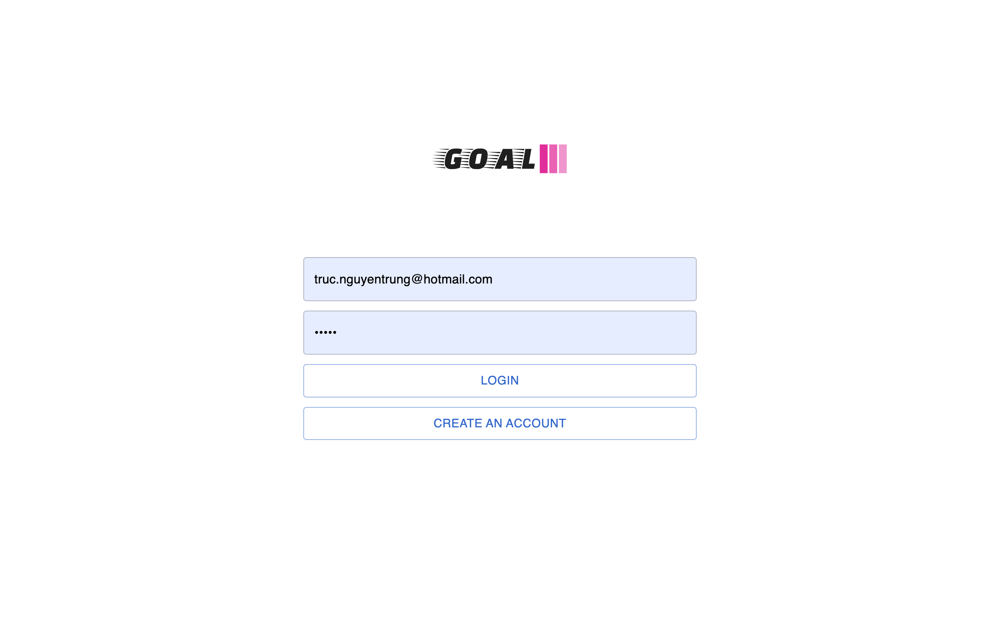
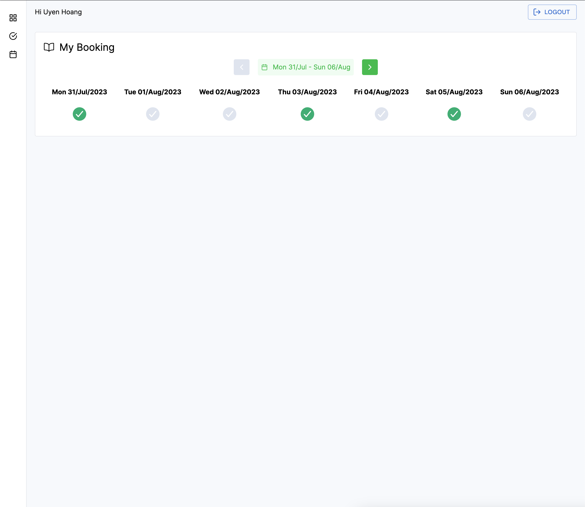
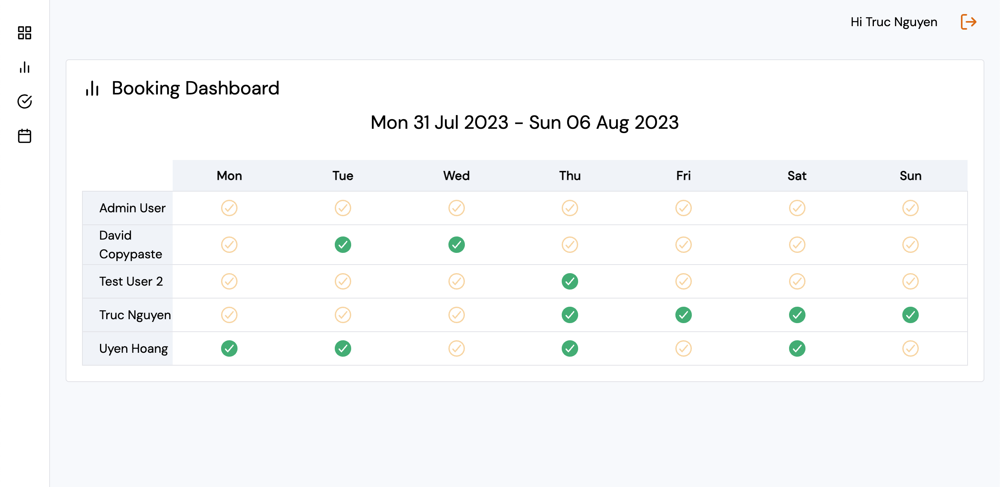

Simple Office Management System

[](https://github.com/tnoss/goal/actions/workflows/codeql.yml)

[](https://github.com/tnoss/goal/actions/workflows/go.yml)

## Planning
- [x] Local DB AuthN
- [x] My Booking
- [x] Booking Dashboard
- [ ] Realtime Update for Dashboard
- [ ] Role-based AuthZ

## Screenshots








## Development

### Start API (hot reload)
```
air
```

### Start API (without hotreload)
```
make run
```

### Start web
```
cd ./web && pnpm dev
```

### Run tests with coverage
```
make test_cov
```
### Go Notes
- Go does not support default parameter
- Go does not support overload (https://go.dev/doc/faq#overloading)

## Stack
- Go
- React
- MUI React
- TailwindCSS
- GORM (Postgres)